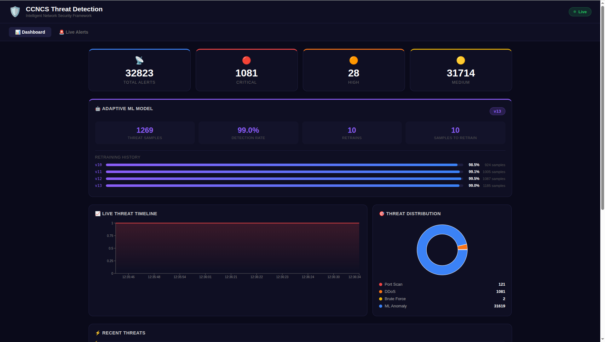
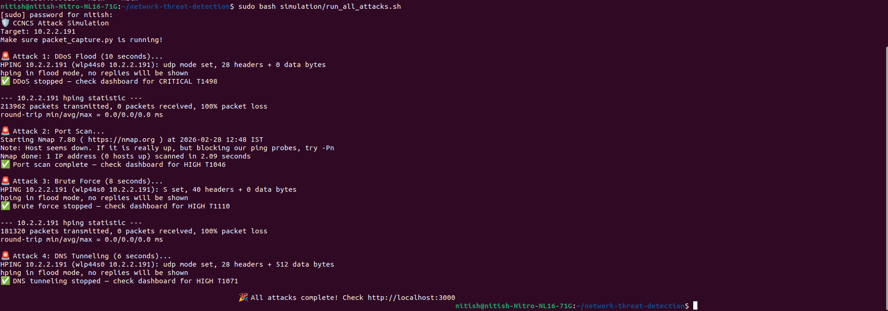
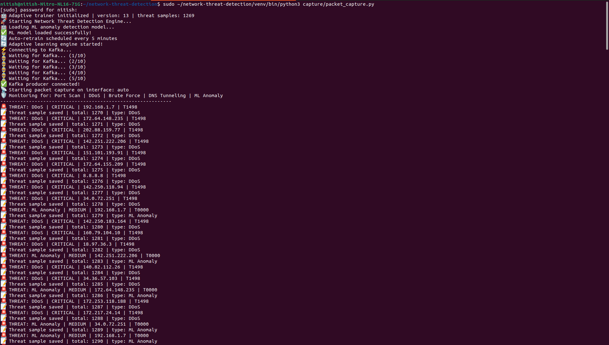
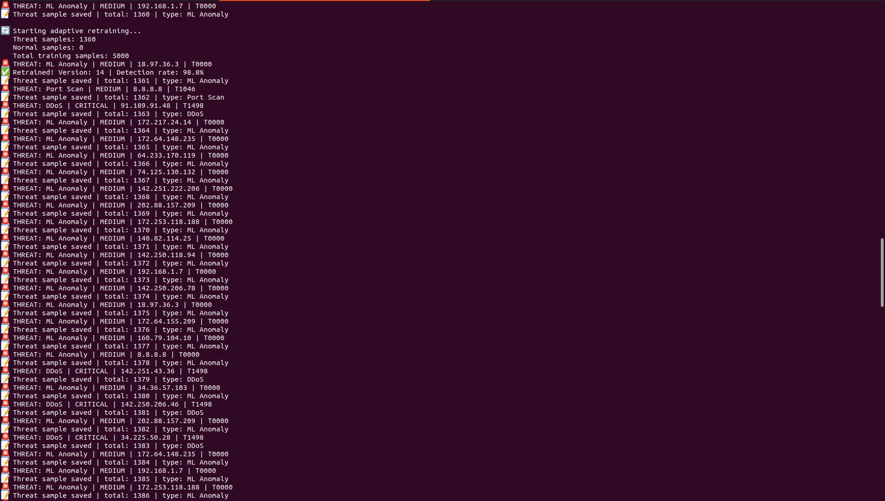
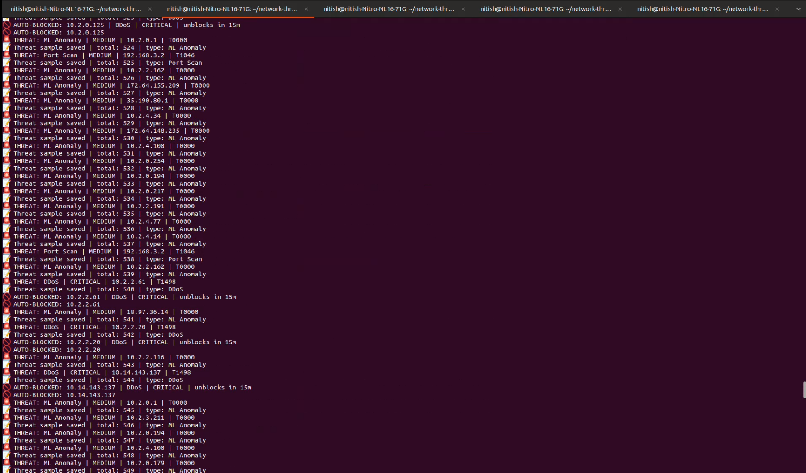

# 🛡️ Intelligent Network Threat Detection & Response Framework

> A real-time network security monitoring system built for **CCNCS — Centre for Computer Networks & Cyber Security, PES University**.  
> Captures live network traffic, detects threats using **ML anomaly detection + rule-based engine**, streams via **Apache Kafka**, and displays on a **live React dashboard** with automated response.

---

## 🖥️ Live Dashboard Screenshots

### 📊 Main Dashboard — Adaptive ML Model + Live Stats


> Real-time threat stats, adaptive ML model metrics (v13, 99% detection rate), live timeline chart, and threat distribution pie — all updating via WebSocket.

---

### 🚨 Live Alerts Feed — MITRE ATT&CK Badges


> Color-coded alert feed with severity, source IP, protocol, MITRE technique ID, and timestamp — filterable by type and severity. Live toast notifications for critical threats.

---

### ⚡ Attack Simulation — All 4 Attack Types


> DDoS flood, Port Scan, Brute Force, and DNS Tunneling simulations using hping3 and nmap — all detected and logged by the system.

---

### 🖥️ Capture Engine — Live Threat Detection


> Packet capture engine detecting DDoS (T1498), ML Anomaly (T0000), Port Scan (T1046) in real-time with adaptive learning samples being collected.

---

### 🔄 Adaptive Retraining — Model v14


> Model automatically retraining with 1360+ threat samples. Detection rate: 98.8% after retraining.

---

### 🚫 Auto Response — IP Blocking


> Internal IPs automatically blocked via iptables when CRITICAL/HIGH threats detected. Auto-unblock after 15 minutes.

---

## 🚀 Features

- 📡 **Live Packet Capture** — Scapy captures raw network packets in real-time
- 🧠 **ML Anomaly Detection** — Isolation Forest model detects unknown traffic anomalies
- 🔎 **Rule-Based Detection** — Detects DDoS, Port Scans, Brute Force, DNS Tunneling
- ⚡ **Kafka Streaming** — High-throughput event pipeline from capture to backend
- 🌐 **WebSocket Push** — Live threat alerts pushed to dashboard instantly
- 🗄️ **PostgreSQL Persistence** — All alerts stored with full metadata
- 🚫 **Auto Response** — iptables IP blocking for CRITICAL/HIGH threats
- 🗺️ **MITRE ATT&CK Mapping** — All threats mapped to ATT&CK framework
- 🔄 **Adaptive Learning** — Model retrains every 5 minutes with real threat data
- 📊 **Live Dashboard** — Real-time charts, stats, and filterable alert feed
- 🎯 **Attack Simulation** — Mininet + hping3 + nmap attack simulation scripts
- 🐳 **Docker Compose** — One-command setup for all infrastructure

---

## 🏗️ Tech Stack

| Layer | Technology |
|---|---|
| Packet Capture | Python, Scapy |
| ML Detection | Scikit-learn (Isolation Forest), Pandas, NumPy |
| Message Queue | Apache Kafka + Zookeeper |
| Backend API | Python, FastAPI, WebSockets |
| Database | PostgreSQL (SQLAlchemy ORM) |
| Cache | Redis |
| Frontend | React, Recharts, react-hot-toast |
| Security Response | iptables, MITRE ATT&CK |
| Simulation | Mininet, hping3, nmap |
| Containerization | Docker, Docker Compose |

---

## 🧠 Threat Detection Methods

| Threat Type | Detection Method | Threshold | Severity | MITRE |
|---|---|---|---|---|
| DDoS | Packets/sec from single IP | >500 pkt/s | CRITICAL | T1498 |
| Port Scan | Unique ports contacted | >15 ports/window | HIGH | T1046 |
| Brute Force | SYN flood to limited ports | >20 SYN, ≤3 ports | HIGH | T1110 |
| DNS Tunneling | Oversized DNS query payload | >200 bytes | HIGH | T1071 |
| ML Anomaly | Isolation Forest outlier | score < -0.25 | MEDIUM | T0000 |

---

## 🔐 Auto Response Engine

| Action | Details |
|---|---|
| Trigger | CRITICAL or HIGH severity from internal IP |
| Method | iptables INPUT DROP rule |
| Duration | Auto-unblock after 15 minutes |
| Whitelist | Public internet IPs never blocked |
| Scope | Only 10.x.x.x, 192.168.x.x, 172.16-20.x.x |
| Log | All actions saved to response/response_log.json |

```bash
# Check currently blocked IPs
curl http://localhost:8000/response/blocked

# Manually unblock an IP
curl -X DELETE http://localhost:8000/response/unblock/10-2-3-15

# View response logs
curl http://localhost:8000/response/logs
```

---

## 🗺️ MITRE ATT&CK Coverage

| Threat | Technique ID | Technique Name | Tactic |
|---|---|---|---|
| DDoS | T1498 | Network Denial of Service | Impact |
| Port Scan | T1046 | Network Service Discovery | Discovery |
| Brute Force | T1110 | Brute Force | Credential Access |
| DNS Tunneling | T1071 | Application Layer Protocol | Command & Control |
| ML Anomaly | T0000 | Unknown / Zero-Day Threat | Unknown |

---

## 📈 Adaptive Learning Results

After running on live CCNCS network traffic:

| Model Version | Threat Samples | Detection Rate |
|---|---|---|
| v1 | 0 (synthetic) | baseline |
| v2 | 64 | 100.0% |
| v5 | 213 | 99.52% |
| v10 | 924 | 98.5% |
| v11 | 1005 | 99.1% |
| v12 | 1087 | 99.5% |
| v13 | 1185 | 99.0% |
| v14 | 1360 | 98.8% |

Model continuously improves as it sees more real network threats!

---

## 📁 Project Structure

```
network-threat-detection/
├── docker-compose.yml
├── capture/
│   ├── packet_capture.py           # Scapy live capture + threat detection
│   ├── feature_extractor.py        # Per-IP flow feature extraction
│   └── kafka_producer.py           # Kafka producer client
├── ml/
│   ├── train_model.py              # Train Isolation Forest model
│   ├── detector.py                 # Real-time ML inference
│   ├── adaptive_trainer.py         # Adaptive retraining engine
│   └── training_data/              # Collected threat samples
├── response/
│   ├── auto_response.py            # iptables auto-blocking engine
│   ├── whitelist.py                # IP whitelist
│   ├── mitre_mapping.py            # MITRE ATT&CK mappings
│   └── response_log.json           # Response audit log
├── simulation/
│   ├── network_topology.py         # Mininet topology
│   ├── attack_simulator.py         # Full Mininet simulation
│   └── run_all_attacks.sh          # Quick attack simulation
├── backend/app/
│   ├── main.py                     # FastAPI + WebSocket
│   ├── models.py                   # DB models with MITRE fields
│   ├── kafka_consumer.py           # Kafka → DB → WebSocket
│   └── routers/
│       ├── alerts.py               # Alert endpoints
│       ├── response.py             # Block/unblock endpoints
│       └── stats.py                # ML metrics endpoint
└── frontend/src/
    ├── App.js                      # Dashboard + Alerts + ML Metrics
    └── App.css
```

---

## ⚙️ Setup & Installation

### 🐳 Step 1 — Start Infrastructure

```bash
git clone https://github.com/NitishDoddamani/network-threat-detection.git
cd network-threat-detection
docker-compose up -d zookeeper kafka db redis
```

### 🐍 Step 2 — Python Virtual Environment

```bash
python3 -m venv venv
source venv/bin/activate
pip install scapy kafka-python fastapi uvicorn sqlalchemy \
    psycopg2-binary redis websockets pydantic-settings \
    scikit-learn==1.3.2 numpy==1.24.4 pandas joblib mininet
```

### 🤖 Step 3 — Train ML Model

```bash
python3 ml/train_model.py
```

### 📡 Step 4 — Start Packet Capture (Terminal 1)

```bash
sudo ~/network-threat-detection/venv/bin/python3 capture/packet_capture.py
```

### ⚙️ Step 5 — Start Backend (Terminal 2)

```bash
source venv/bin/activate && cd backend
uvicorn app.main:app --reload --host 0.0.0.0 --port 8000
```

### 🌐 Step 6 — Start Dashboard (Terminal 3)

```bash
cd frontend && npm install && npm start
# Open http://localhost:3000
```

### 🎯 Step 7 — Run Attack Simulation (Terminal 4)

```bash
sudo bash simulation/run_all_attacks.sh
```

---

## 🔄 System Architecture

```
Network Traffic
      ↓
Scapy Packet Capture
      ↓
Feature Extraction (per-IP flow stats)
      ↓
┌─────────────────────────────┐
│      Threat Detection       │
│  ├── Rule-Based Engine      │ ← DDoS, Port Scan, Brute Force, DNS
│  └── ML Isolation Forest    │ ← Anomaly Detection
└─────────────────────────────┘
      ↓
┌─────────────────────────────┐
│      Auto Response          │
│  ├── iptables IP block      │ ← CRITICAL/HIGH internal IPs
│  ├── MITRE ATT&CK enrich    │ ← T1498/T1046/T1110/T1071
│  └── Adaptive trainer feed  │ ← collect for retraining
└─────────────────────────────┘
      ↓
Kafka → FastAPI → PostgreSQL → WebSocket → React Dashboard
      ↓
┌─────────────────────────────┐
│    Adaptive Learning        │
│  ├── Collect samples        │
│  ├── Retrain every 5 min    │
│  └── Model versioning       │
└─────────────────────────────┘
```

---

## 🔌 API Reference

| Endpoint | Method | Description |
|---|---|---|
| `/alerts/` | GET | All threat alerts |
| `/alerts/stats/summary` | GET | Threat summary stats |
| `/response/blocked` | GET | Currently blocked IPs |
| `/response/logs` | GET | Response audit log |
| `/response/unblock/{ip}` | DELETE | Manually unblock IP |
| `/stats/ml-metrics` | GET | ML model metrics |
| `/ws` | WebSocket | Live threat feed |
| `/docs` | GET | Interactive API docs |

---

## 🔮 Future Improvements

- [ ] Geo-location mapping for source IPs
- [ ] Email / Slack alerting for CRITICAL threats
- [ ] PCAP file upload for offline analysis
- [ ] Snort/Suricata IDS integration
- [ ] SIEM/SOAR workflow integration
- [ ] More ML models (Random Forest, Autoencoder)
- [ ] Zero-day threat signature generation

---

## 👨‍💻 Author

**Nitish Doddamani**
Research Intern — CCNCS, PES University
Guide: Dr. Vinodha K

[GitHub](https://github.com/NitishDoddamani) | [LinkedIn](https://linkedin.com/in/nitish-doddamani)

---

## 📄 License

MIT License
