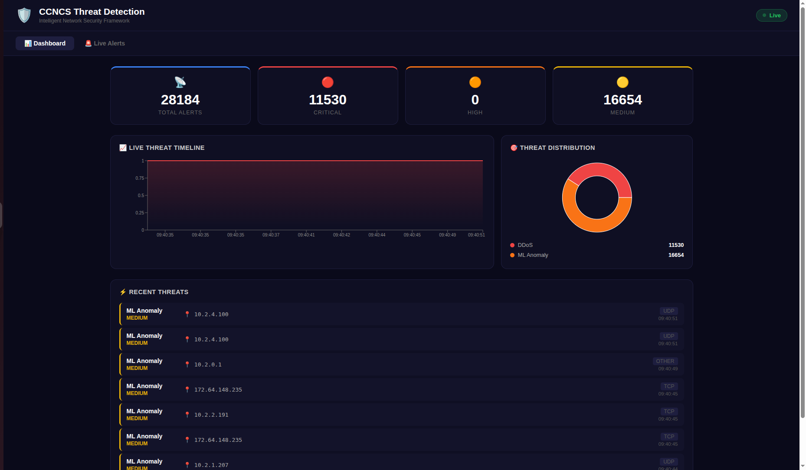
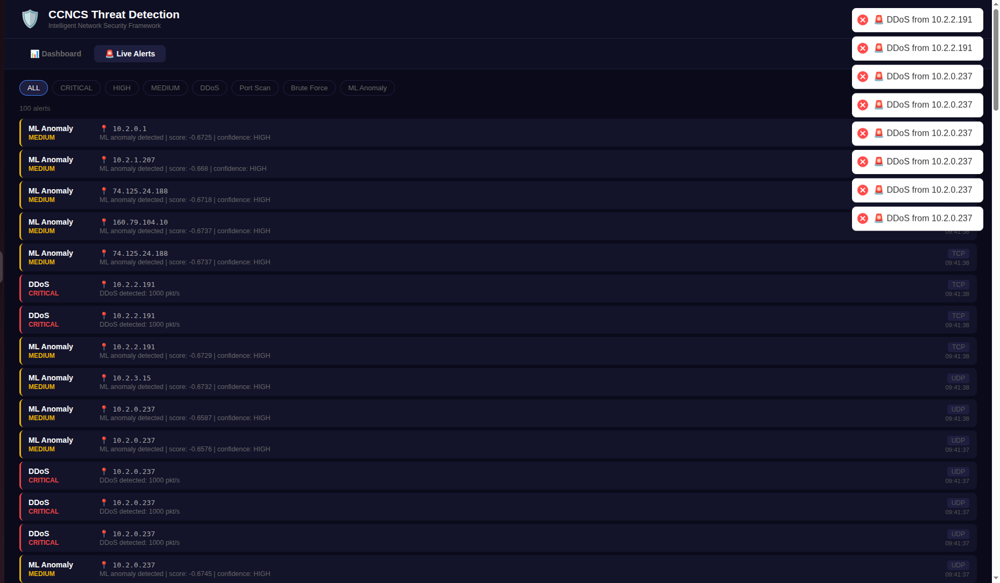

# 🛡️ Intelligent Network Threat Detection & Response Framework

A real-time network security monitoring system built for **CCNCS — Centre for Computer Networks & Cyber Security, PES University**.  
Captures live network traffic, detects threats using **ML anomaly detection + rule-based engine**, streams via **Kafka**, and displays on a **live React dashboard**.

---

## 🖥️ Live Dashboard Screenshots

📊 **1️⃣ Main Dashboard — Live Stats & Charts**
<p align="center">  </p>

Real-time threat stats, live timeline chart, and threat distribution pie — all updating via WebSocket.

🚨 **2️⃣ Live Alerts Feed**
<p align="center">  </p>

Color-coded alert feed with severity, source IP, protocol, and timestamp — filterable by type and severity.

---

## 🚀 Features

- 📡 **Live Packet Capture** — Scapy captures raw network packets in real-time
- 🧠 **ML Anomaly Detection** — Isolation Forest model detects unknown traffic anomalies
- 🔎 **Rule-Based Detection** — Detects DDoS, Port Scans, Brute Force, DNS Tunneling
- ⚡ **Kafka Streaming** — High-throughput event pipeline from capture to backend
- 🌐 **WebSocket Push** — Live threat alerts pushed to dashboard instantly
- 🗄️ **PostgreSQL Persistence** — All alerts stored with full metadata
- 📊 **Live Dashboard** — Real-time charts, stats, and filterable alert feed
- 🐳 **Docker Compose** — One-command setup for all infrastructure

---

## 🏗️ Tech Stack

| Layer            | Technology                                      |
|------------------|-------------------------------------------------|
| Packet Capture   | Python, Scapy                                   |
| ML Detection     | Scikit-learn (Isolation Forest), Pandas, NumPy  |
| Message Queue    | Apache Kafka + Zookeeper                        |
| Backend API      | Python, FastAPI, WebSockets                     |
| Database         | PostgreSQL (SQLAlchemy ORM)                     |
| Cache            | Redis                                           |
| Frontend         | React, Recharts, react-hot-toast                |
| Containerization | Docker, Docker Compose                          |

---

## 🧠 Threat Detection Methods

| Threat Type   | Detection Method                                         | Severity |
|---------------|----------------------------------------------------------|----------|
| DDoS          | Packets/sec threshold (>1000 pkt/s from single IP)       | CRITICAL |
| Port Scan     | Unique ports contacted threshold (>15 ports in window)   | HIGH     |
| Brute Force   | SYN flood to limited ports (>20 SYN, ≤3 unique ports)    | HIGH     |
| DNS Tunneling | Oversized DNS query payload (>200 bytes)                  | HIGH     |
| ML Anomaly    | Isolation Forest outlier detection on flow features       | MEDIUM   |

---

## 📁 Project Structure

```
network-threat-detection/
├── docker-compose.yml              # Kafka, Zookeeper, PostgreSQL, Redis
├── capture/
│   ├── packet_capture.py           # Scapy live capture + threat detection
│   ├── feature_extractor.py        # Per-IP flow feature extraction
│   └── kafka_producer.py           # Kafka producer client
├── ml/
│   ├── train_model.py              # Train Isolation Forest model
│   ├── detector.py                 # Real-time ML inference
│   └── models/                     # Saved model files (gitignored)
│       ├── isolation_forest.pkl
│       └── scaler.pkl
├── backend/
│   ├── Dockerfile
│   ├── requirements.txt
│   └── app/
│       ├── main.py                 # FastAPI app + WebSocket endpoint
│       ├── config.py               # Environment settings
│       ├── database.py             # PostgreSQL connection
│       ├── models.py               # SQLAlchemy models
│       ├── websocket_manager.py    # WebSocket broadcast manager
│       ├── kafka_consumer.py       # Kafka → PostgreSQL → WebSocket
│       └── routers/
│           ├── alerts.py           # Alert CRUD + stats endpoints
│           └── stats.py            # Traffic statistics
└── frontend/
    ├── package.json
    └── src/
        ├── index.js
        ├── App.js                  # Dashboard + Live Alerts
        └── App.css
```

---

## ⚙️ Setup & Installation

### Prerequisites
- Python 3.10+
- Node.js 18+
- Docker Desktop
- Linux / Ubuntu (required for raw packet capture)

---

### 🐳 Step 1 — Start Infrastructure with Docker

```bash
git clone https://github.com/NitishDoddamani/network-threat-detection.git
cd network-threat-detection

# Start Kafka, Zookeeper, PostgreSQL, Redis
docker-compose up -d zookeeper kafka db redis

# Verify all running
docker-compose ps
```

---

### 🐍 Step 2 — Setup Python Virtual Environment

```bash
python3 -m venv venv
source venv/bin/activate

pip install scapy kafka-python fastapi uvicorn sqlalchemy \
    psycopg2-binary redis websockets pydantic-settings \
    scikit-learn==1.3.2 numpy==1.24.4 pandas joblib
```

---

### 🤖 Step 3 — Train ML Model

```bash
python3 ml/train_model.py
```

Expected output:
```
📊 Generating normal traffic training data...
✅ Generated 5000 normal traffic samples
🤖 Training Isolation Forest model...
✅ Model saved to ml/models/isolation_forest.pkl
🧪 Testing model with anomalous traffic...
  🚨 ANOMALY | DDoS simulation    | score: -0.702
  🚨 ANOMALY | Port Scan sim      | score: -0.702
  🚨 ANOMALY | Idle host          | score: -0.674
🎉 Training complete!
```

---

### 📡 Step 4 — Start Packet Capture (Terminal 1)

```bash
# Requires sudo for raw packet access
sudo ~/network-threat-detection/venv/bin/python3 capture/packet_capture.py
```

Expected output:
```
🚀 Starting Network Threat Detection Engine...
🤖 Loading ML anomaly detection model...
✅ ML model loaded successfully!
⚡ Connecting to Kafka...
✅ Kafka producer connected!
📡 Starting packet capture on interface: auto
🛡️  Monitoring for: Port Scan | DDoS | Brute Force | DNS Tunneling | ML Anomaly
------------------------------------------------------------
🚨 THREAT: DDoS      | CRITICAL | 192.168.1.7
🚨 THREAT: ML Anomaly| MEDIUM   | 10.2.0.194
```

---

### ⚙️ Step 5 — Start Backend API (Terminal 2)

```bash
source venv/bin/activate
cd backend
uvicorn app.main:app --reload --host 0.0.0.0 --port 8000
```

Expected output:
```
🚀 Backend started! Kafka consumer running in background.
⚡ Starting Kafka consumer...
✅ Kafka consumer connected!
📨 Received from Kafka: DDoS | 192.168.1.7
```

API available at:
| Endpoint | Description |
|---|---|
| `http://localhost:8000/docs` | Interactive API docs |
| `http://localhost:8000/alerts/` | All alerts |
| `http://localhost:8000/alerts/stats/summary` | Summary stats |
| `ws://localhost:8000/ws` | WebSocket live feed |

---

### 🌐 Step 6 — Start Frontend Dashboard (Terminal 3)

```bash
cd frontend
npm install
npm start
```

Open **`http://localhost:3000`** 🚀

---

## 🔄 System Architecture

```
Network Traffic
      ↓
Scapy Packet Capture (sudo)
      ↓
Feature Extraction (per-IP flow stats)
      ↓
┌─────────────────────────┐
│  Threat Detection       │
│  ├── Rule-Based Engine  │ ← DDoS, Port Scan, Brute Force, DNS Tunnel
│  └── ML Isolation Forest│ ← Anomaly Detection
└─────────────────────────┘
      ↓ threat detected
Kafka Producer → [network-threats topic]
      ↓
Kafka Consumer (FastAPI background thread)
      ↓
    ┌───────────────────┐
    │  PostgreSQL       │ ← persistent storage
    └───────────────────┘
      ↓
WebSocket Broadcast
      ↓
React Dashboard (live updates)
```

---

## 🔌 API Reference

### GET `/alerts/`
Returns recent threat alerts.

```bash
curl http://localhost:8000/alerts/?limit=10
```

```json
[
  {
    "id": 1,
    "threat_type": "DDoS",
    "severity": "CRITICAL",
    "src_ip": "192.168.1.7",
    "protocol": "UDP",
    "packet_count": 1200,
    "description": "DDoS detected: 1200 pkt/s",
    "created_at": "2026-02-26T09:36:48"
  }
]
```

### GET `/alerts/stats/summary`
Returns threat statistics breakdown.

```bash
curl http://localhost:8000/alerts/stats/summary
```

```json
{
  "total_alerts": 26128,
  "critical": 10555,
  "high": 0,
  "medium": 15573,
  "breakdown": [
    { "type": "DDoS",       "count": 10555 },
    { "type": "ML Anomaly", "count": 15573 }
  ]
}
```

---

## 🐳 Docker Infrastructure

```
docker-compose up -d
      ├── zookeeper   (Kafka coordinator)     :2181
      ├── kafka       (Message broker)        :9092
      ├── db          (PostgreSQL 15)         :5432
      └── redis       (Cache)                 :6379
```

---

## 🔮 Future Improvements

- [ ] Geo-location mapping for source IPs
- [ ] Email / Slack alerting for CRITICAL threats
- [ ] Auto-response (firewall rule injection via iptables)
- [ ] PCAP file upload and offline analysis
- [ ] More ML models (Random Forest, Autoencoder)
- [ ] Multi-interface capture support
- [ ] Threat correlation across multiple IPs

---

## 👨‍💻 Author

**Nitish Doddamani**  
Research Intern — CCNCS, PES University  
[GitHub](https://github.com/NitishDoddamani) | [LinkedIn](https://linkedin.com/in/nitish-doddamani)

---

## 📄 License

MIT License
